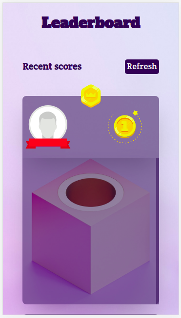
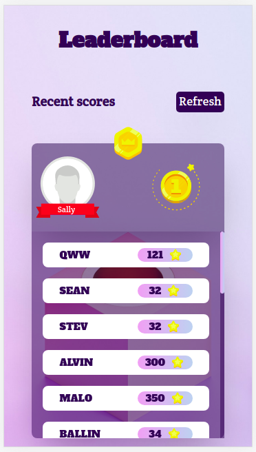
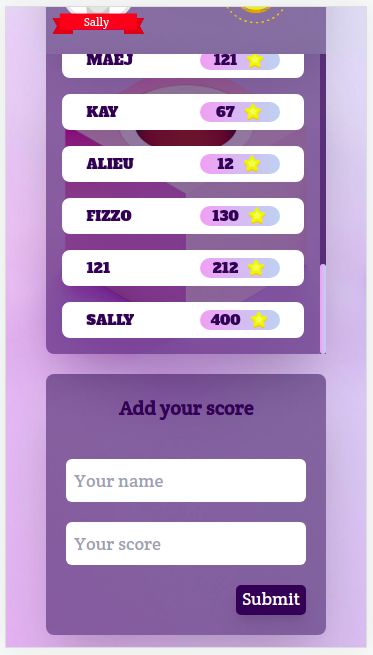

# leaderboard

> The leaderboard website displays scores submitted by different players. It also allows you to submit your score. All data is preserved thanks to the external [Leaderboard API service.](https://www.notion.so/Leaderboard-API-service-24c0c3c116974ac49488d4eb0267ade3)

Leaderboard Brief Demo                                                                                                    |
:------------------------------------------------------------------------------------------------------------------------:|
                                                                                  |

Mobile View 1                           | Mobile View 2                          | Mobile View 3                          |
:--------------------------------------:|:--------------------------------------:|:--------------------------------------:|
  |  |  |

## Online version
[Live Demo](https://mmsesay.github.io/leaderboard/)

## Built With

- HTML / CSS / JAVASCRIPT / WEBPACK

## How to run the program locally
- Clone the project: ```https://github.com/mmsesay/leaderboard.git```
- Skip if you already have node installed otherwise download [nodejs](https://nodejs.org/en/download/) install it on your system
- Install the node modules: ```npm install```
- Run the app: ```npm start``` or ```yarn start```

## Author

👤 **Muhammad Mustapha Sesay**

- GitHub: [@mmsesay](https://github.com/mmsesay)
- Twitter: [@DeeMaejor](https://twitter.com/DeeMaejor)
- LinkedIn: [LinkedIn](https://linkedin.com/in/muhammad-m-sesay)

## 🤝 Contributing

Contributions, issues, and feature requests are welcome!

Feel free to check the [issues page](../../issues/).

## Show your support

Give a ⭐️ if you like this project!

## Acknowledgments
- microverseinc for the readme template
- [Leaderboard API service.](https://www.notion.so/Leaderboard-API-service-24c0c3c116974ac49488d4eb0267ade3)
- [Rodion Kutsaiev](https://www.pexels.com/photo/yellow-and-white-3-d-cube-9436715/) at Pexels.com for the background image

## 📝 License

This project is [MIT](./MIT.md) licensed.
